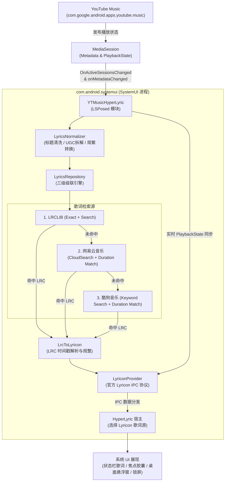

# YouTube Music HyperLyric

<div align="center">

[-brightgreen.svg)](#环境要求)
[](#工作原理)
[](https://github.com/limczhh/HyperLyric)
[](https://kotlinlang.org)
[](#三源智能兜底聚合)

**专为 YouTube Music 打造的 HyperLyric 高精度实时同步歌词增强模块**  
让 YouTube Music 在小米 HyperOS 及现代 Android 系统上完美接入 HyperLyric，享受优雅的状态栏、灵动岛/焦点胶囊、桌面悬浮窗与锁屏歌词。

[特性介绍](#核心特性) • [工作原理](#工作原理) • [安装使用](#安装与使用) • [编译构建](#编译与构建) • [调试排查](#调试与日志) • [常见问题](#常见问题)

</div>

---

## 📖 项目背景

[HyperLyric](https://github.com/limczhh/HyperLyric) 是一款优秀的 Android 状态栏与桌面歌词渲染工具。然而在实际使用 YouTube Music 时，用户常面临以下痛点：

1. **官方歌词源缺失**：YouTube Music 官方未对外开放实时逐句歌词接口，且国际服歌词覆盖与时间轴质量参差不齐。
2. **元数据噪声严重**：YT Music 歌曲标题普遍带有 `(Official Music Video)`、`[MV]`、`feat. xxx`、`(Live)` 等视频发行标记，歌手名常带有 `- Topic`，导致普通歌词插件精确匹配失败率极高。
3. **UGC 与二创翻唱难匹配**：第三方上传的视频/音乐常使用 `歌名 - 歌手` 或复合标题，常规检索无法命中。
4. **简繁异体差异**：华语经典曲目（如周杰伦、林俊杰）在 YT Music 上大多采用繁体中文元数据，直接检索国内歌词库易出现大面积落空。
5. **HyperOS 动态 DEX 限制**：在小米 HyperOS / Android 14+ 下，系统 ART 机制默认拒绝从可写路径加载 DEX，导致 HyperLyric 原生 ZIP 插件无法正常加载执行。

**YTMusicHyperLyric** 专为解决上述问题而设计。它作为原生 LSPosed 模块运行在 `SystemUI` 中，零侵入式监听 YouTube Music 媒体播放，集成**元数据智能清洗**、**内置零依赖简繁转换**与 **LRCLIB + 网易云音乐 + 酷狗音乐三源自动级联兜底**，并通过标准 **Lyricon** 协议将毫秒级同步歌词交付给 HyperLyric 呈现。

---

## ✨ 核心特性

- 🎵 **零侵入 MediaSession 监听**  
  无需解包、修改或注入 YouTube Music 客户端本身。通过 Android 原生 `MediaSessionManager` 系统接口监听播放状态与媒体元数据，稳定且不受 YT Music 版本更新影响。
- 🔄 **三源智能级联检索 (LRCLIB + 网易云 + 酷狗)**  
  - **首选 LRCLIB**：欧美与国际流行曲目第一梯队高精度时间轴，支持 Exact 精确查询与 Search 模糊搜索；
  - **备选网易云音乐 (Netease)**：海量华语流行曲库快速检索与评分匹配；
  - **兜底酷狗音乐 (Kugou)**：超全小众曲库、古风及二创老歌超高命中率终极兜底。
- 🧹 **深度元数据清洗与候选提取 (`LyricsNormalizer`)**  
  - 自动剥离 `(Official Video)`、`[MV]`、`4K/1080P`、`Live`、`Remastered`、`Feat.` 等干扰后缀；
  - 自动剔除 YouTube 官方自动生成频道的 `- Topic` 艺术家后缀；
  - 智能拆解二创/UGC 命名规范（如 `夜猫 - 张蔷`），自动提取候选 `(标题, 艺术家)` 对并进行纯歌名降级匹配；
  - 结合时长容差（Duration Matching）评分算法，有效杜绝翻唱、Live 版与录音室版的串歌误匹配。
- 🀄 **内置简繁转换引擎 (`ChineseConverter`)**  
  零第三方依赖，内置基于 OpenCC 标准的 2,966 对 BMP 常用汉字映射表，透明打通繁体标题/歌手到简体歌词源的检索壁垒。
- ⏱️ **后台精准进度同步与切歌防抖**  
  - 实时同步 `PlaybackState` 进度与速率，切到后台、锁屏熄屏歌词时间轴均平滑走字，不漂移、不卡顿；
  - 基于单调递增 Sequence 令牌与原子校验，快速切歌时彻底杜绝网络旧请求结果回写覆盖新歌曲（Race Condition）。
  - 内置 64 条并发 LRU 缓存，切回已播歌曲毫秒级秒开。
- 🛡️ **HyperOS 动态 DEX 兼容补丁**  
  模块内嵌 SystemUI 级 Hook，动态拦截 `BaseDexClassLoader` 并在 ART 加载前将 HyperLyric 释放的插件 DEX 标记为只读，原生解决 HyperOS / Android 14+ 报错拒绝加载可写 DEX 的痛点。

---

## 🏗️ 工作原理



---

## 📱 环境要求

- **操作系统**：Android 13 及以上（API 33+），兼容 Xiaomi HyperOS 1.0 / 2.0
- **Root 环境**：已安装 Magisk / KernelSU / APatch
- **Xposed 框架**：[LSPosed](https://github.com/mywalkb/LSPosed_mod) 或兼容现代 LibXposed 规范的框架
- **宿主应用**：[HyperLyric](https://github.com/limczhh/HyperLyric)（推荐 v7.4 及以上版本）
- **播放器**：[YouTube Music](https://play.google.com/store/apps/details?id=com.google.android.apps.youtube.music)（官方版或 Revanced 等第三方修改版均可）

---

## 🚀 安装与使用

### 第一步：获取与安装模块

1. 从 [Releases](../../releases) 下载最新的 `xposed-lrclib-release.apk`（或自行编译）；
2. 在设备上正常安装该 APK。

### 第二步：配置 LSPosed 作用域

1. 打开 **LSPosed** 管理器；
2. 在模块列表中找到 **YouTube Music HyperLyric**（包名：`moe.lance.ytmusiclyric`）并启用；
3. **作用域配置**：
   - 勾选 **系统界面 (`System UI` / `com.android.systemui`)**；
   - ⚠️ **请勿勾选 YouTube Music**（模块运行在 SystemUI 进程内监听媒体会话，无需勾选播放器本身）；
4. **重启手机** 或在 LSPosed 中重启 SystemUI。

### 第三步：配置 HyperLyric 宿主

1. 打开 **HyperLyric** 应用；
2. 进入歌词源设置，确保将歌词源切换/勾选为 **Lyricon**；
3. 授予 HyperLyric 所需的悬浮窗、状态栏通知或辅助功能权限。

### 第四步：畅享同步歌词

打开 **YouTube Music** 播放任意歌曲，HyperLyric 状态栏/灵动岛胶囊将即刻呈现精准同步的歌词！

---

## 🛠️ 编译与构建

本项目使用标准的 Gradle Kotlin DSL 进行构建，支持 JDK 17 / 21 环境。

### 仓库代码结构

```text
YTMusicHyperLyric/
├── Modules/
│   └── xposed-lrclib/          # 【当前主力】原生 LSPosed 模块 APK (SystemUI 注入)
│       ├── src/main/java/moe/lance/ytmusiclyric/
│       │   ├── LrclibXposedModule.kt   # LSPosed 入口、SystemUI 监听与 Lyricon Bridge
│       │   ├── LyricsRepository.kt     # 多源协调器与缓存调度
│       │   ├── LyricsNormalizer.kt     # 标题/艺术家清洗、UGC 拆解与候选生成
│       │   ├── ChineseConverter.kt     # 零依赖 OpenCC 简繁汉字转换
│       │   ├── LrclibClient.kt         # LRCLIB API 客户端
│       │   ├── NeteaseClient.kt        # 网易云音乐 API 客户端与打分筛选
│       │   ├── KugouClient.kt          # 酷狗音乐 API 客户端与打分筛选
│       │   └── LrcToLyricon.kt         # LRC 时间轴解析与模型转换
│       └── src/test/java/              # 单元测试 (清洗规则、简繁转换、解析器、端到端测试)
├── Plugins/                            # 【兼容备份】HyperLyric 规范原生 ZIP 插件实现
│   ├── api/                            # HyperLyric Plugin API 引用存根
│   └── modules/lrclib/                 # 早期 ZIP 形式的 LRCLIB 插件
└── plan/                               # 方案演进与架构设计备忘录
```

### 构建步骤

```powershell
# 克隆仓库
git clone https://github.com/LanceMoe/YTMusicHyperLyric.git
cd YTMusicHyperLyric

# 运行单元测试验证功能逻辑
.\gradlew.bat test --max-workers=2

# 编译 Debug 版 LSPosed 模块 APK
.\gradlew.bat :modules:xposed-lrclib:assembleDebug --max-workers=2

# 编译 Release 版 LSPosed 模块 APK
.\gradlew.bat :modules:xposed-lrclib:assembleRelease --max-workers=2
```

编译生成的 APK 位于：
- Debug：`Modules/xposed-lrclib/build/outputs/apk/debug/xposed-lrclib-debug.apk`
- Release：`Modules/xposed-lrclib/build/outputs/apk/release/xposed-lrclib-release-unsigned.apk`

---

## 🔍 调试与日志

模块使用原生 Android Log 系统输出结构化日志。如遇歌词无法显示或匹配异常，可通过 ADB 抓取过滤日志：

```powershell
# 实时过滤模块与 HyperLyric 日志
adb logcat -b all -v time -s YTMusicHyperLyric:V HyperLyric:V '*:S'
```

### 常见日志排查点

- `LSPosed module loaded` / `Application.onCreate hook installed`：表示模块成功注入 SystemUI 并在应用启动阶段挂钩；
- `Lyricon connection established`：表示模块与 HyperLyric 的 Lyricon Provider 服务握手成功；
- `Using YT Music MediaSession`：检测到 YouTube Music 活跃播放器会话；
- `LRCLIB exact match hit` / `Netease hit` / `Kugou hit`：表示对应歌词源成功命中；
- `Published X lyric lines: Title — Artist`：歌词成功推送给 HyperLyric。

---

## ❓ 常见问题 (FAQ)

### Q1: 为什么采用独立 LSPosed 模块，而不是 HyperLyric 插件中心的 ZIP 插件？
> **答**：在较新的 HyperOS 及 Android 14+ 系统上，系统级安全策略禁止 ART 加载存放于应用私有可写目录（如 `SystemUI/code_cache`）中的 DEX 文件，导致原生 ZIP 插件往往尚未执行入口就抛出 `writable dex file` 异常崩溃。通过将功能前移为原生 LSPosed 模块，不仅规避了加载权限限制，还能主动通过 Hook 为 HyperLyric 修复 DEX 只读属性，运行更加稳定。

### Q2: 为什么切歌后偶尔需要等 1~2 秒才出歌词？
> **答**：模块为了保证歌词命中率，采用 **LRCLIB -> 网易云 -> 酷狗** 的级联查询策略。若海外源未命中，会毫秒级无缝下探到国内源。查询完毕后结果会写入高速缓存，同一首歌曲再次播放时即可秒级加载。

### Q3: 为什么支持二创/搬运视频（UGC）的歌曲？
> **答**：很多 YouTube Music 用户会收听非官方录音室发行的二创音源（如频道名作为歌手、标题为 `歌名 - 原唱` 的视频）。模块内置了 `LyricsNormalizer.resolveSearchPairs` 拆分算法，结合歌曲时长评分比对，即使是搬运视频也能高精度识别并抓取正版伴奏歌词。

---

## 🤝 致谢与开源项目

- [HyperLyric](https://github.com/limczhh/HyperLyric)：极为出色的 Android 系统级状态栏歌词呈现引擎
- [Lyricon](https://github.com/proify/lyricon)：通用高效的第三方播放器歌词通信规范
- [LRCLIB](https://lrclib.net/)：纯粹、开放且高质量的开放社区同步歌词服务
- [LibXposed](https://github.com/libxposed/api)：现代、轻量的下一代 Xposed 接口标准
- [OpenCC](https://github.com/BYVoid/OpenCC)：中文简繁转换标准字形映射

---

## 📄 许可证与免责声明

- 本项目采用开源协议授权，源码仅供个人学习、技术研究与 Android 系统交互实验使用。
- 模块抓取的所有歌词文本、音乐元数据版权均归原音乐平台、词曲作者及版权所有方所有，模块本身不存储、不分发任何受版权保护的音源或商业数据。
